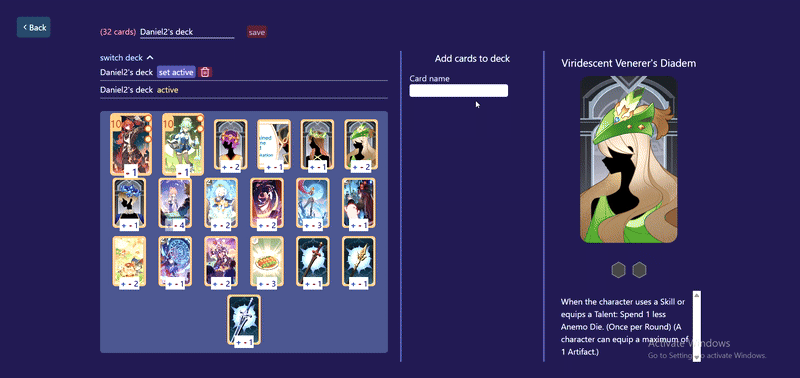
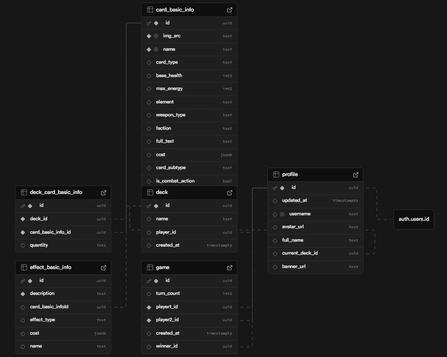

# GITCG simulator

GITCG simulator is an automatic online player-vs-player Genius Invokation Trading Card Game simulator. 
[View demo](https://gitcg-sim.vercel.app/)

To check out the website you can join as a guest without using any credentials. Since this is a practice project with no real-life users, you can try the player-vs-player gameplay on your own by creating guest acounts in two different browsers (or a private and a non-private tab in the same browser) and joining the lobby in both browsers.  

## Features
- User authentication
- Lobby-based matchmaking
- 36 cards, all with fully automated effects
- Automated card damage and die calculation
- Deck creation and editing, copying other players' decks
- Game history

## Media
Deck builder usage example  

  
  
Gameplay example:  
  
This gameplay example, made using two browsers, shows:
 - matchmaking by entering the lobby
 - turn phases changing only when both players are ready
 - fully synchronized gameplay - when one player's game state (cards, dice) changes, the change is propagated to the other player
 - attack damage calculation and statuses (the snowflake icon represents an ice status applied by the atacking card) 

## Tech Stack

**Client:** TypeScript, React, Recoil, TailwindCSS

**Database:** Supabase

##  Database Tables

## Run Locally

### Database Setup

